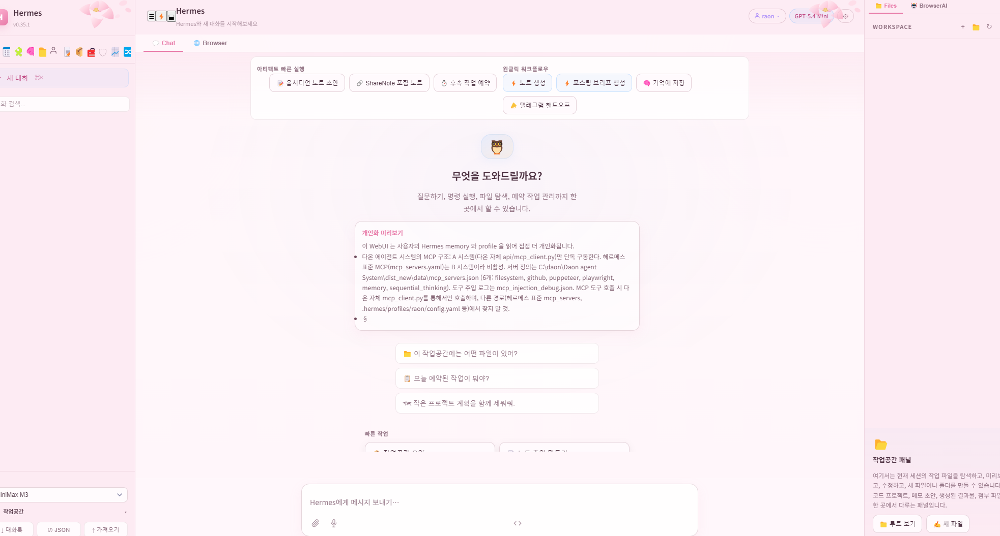

# DAON Agent System


DAON Agent System은 Hermes Agent 기반 위에 구축된 **한국어 1등 멀티에이전트 데스크톱 IDE**입니다.
단일 사용자(대표님) 환경을 위해 최적화되었으며, 강력한 AI 에이전트 파이프라인과 다채로운 도구를 제공하여 생산성을 극대화합니다.

---

## ✨ 주요 기능

*   **Dynamic Hermes JIT 컴파일러**: 사용자의 자연어 미션을 분석하여 런타임에 DAG 형태의 에이전트 파이프라인(Planner → Compiler → Runner → Merger)을 즉석에서 조립하고 실행합니다.
*   **Persona 및 Skill 시스템**: 17개의 특화 스킬(bill, sherlock, prada 등)과 7개의 전문가 역할(writer, reviewer, tester 등)을 상황에 맞게 자동 주입합니다.
*   **강력한 브라우저 자동화**: Playwright MCP 및 CDP(Chrome DevTools Protocol)를 통해 브라우저를 직접 제어하고, 실시간 화면 공유 및 레코딩을 지원합니다.
*   **확장 가능한 MCP(Model Context Protocol) 통합**: 
    *   Filesystem, Playwright, Memory, Daon-Design, Figma, PlayMCP-Gateway 등 6개의 MCP 서버와 유기적으로 연동합니다.
*   **Style Card 시스템**: 뛰어난 디자인의 웹페이지/앱에서 디자인 DNA를 추출하고 믹싱하여 트렌디한 UI 컴포넌트를 즉시 생성합니다.
*   **Demo → Skill 기능**: 사용자의 시연 과정을 자동으로 녹화·학습하여 재사용 가능한 스킬(`SKILL.md`)로 자동 변환합니다.

---

## 📸 스크린샷

### 메인 인터페이스 및 HTML 문서 미리보기
DAON Agent System의 분할 화면 기능으로, 좌측에서는 Monaco Editor 기반의 편집기를 사용하고 우측에서는 실시간 브라우저 미리보기(Playwright 연동)를 제공합니다. 시스템 아키텍처 문서 등 산출물을 바로 렌더링하여 확인할 수 있습니다.



---


## 🏛 시스템 아키텍처

DAON Agent System은 안정성과 확장성을 위해 **4-Tier 아키텍처**로 구성되어 있습니다.

1.  **Presentation Tier**: Electron 기반의 데스크톱 UI, Monaco Editor 통합, 실시간 SSE 스트리밍
2.  **Orchestration Tier**: 작업 계획(Planner), 에이전트 빌드(AgentCompiler), 병렬 실행(ParallelRunner), 결과 병합(ResultMerger)
3.  **Execution Tier**: LLM 직접 호출, 62+개의 CLI 도구 실행, MCP 클라이언트 요청 처리
4.  **Persistence Tier**: SQLite 세션 관리, 메모리 영구 저장소, Skill Registry, 로컬 파일 시스템 제어

> 💡 상세한 시스템 아키텍처 다이어그램 및 엔드포인트 설명은 `docs/DAON_아키텍처_문서.html` 파일을 참고하세요.

---

## 💻 기술 스택

*   **Backend**: Python 3 (Custom HTTP Server / FastAPI 유사 구조)
*   **Frontend**: HTML5, Vanilla JavaScript, CSS (Tailwind 무의존성), Monaco Editor
*   **Desktop App**: Electron, PyInstaller (Bundling)
*   **AI & Tools**: LLM 연동, Playwright, Model Context Protocol (MCP)

---

## 🚀 시작하기

**1. 로컬 환경 실행**
```bash
# 백엔드 서버 시작
python server.py

# 프론트엔드 (Electron) 실행
npm run start
```

**2. 프로덕션 빌드 (Windows)**
```bash
# 백엔드 실행 파일 생성
npm run build:py

# Electron 앱 패키징 및 Setup.exe 생성
npm run build
```
배포된 설치 파일은 `dist/DAON Agent System Setup 1.0.0.exe` 경로에서 확인할 수 있습니다.
