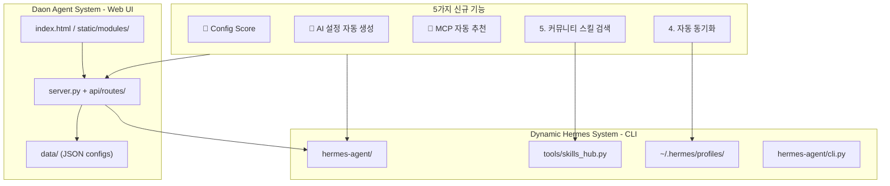
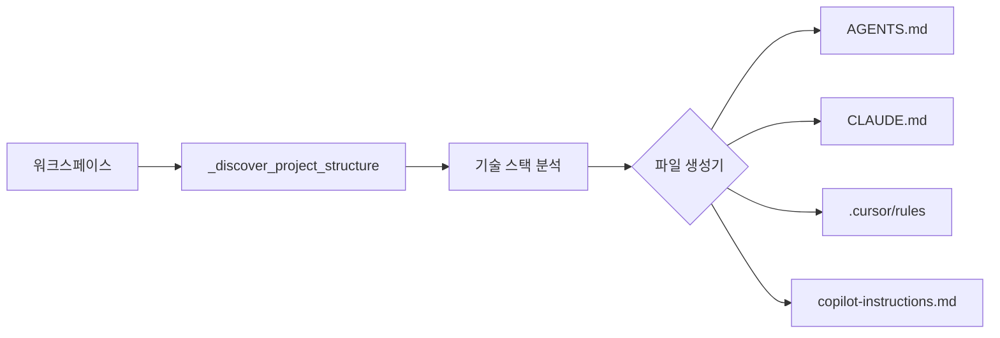
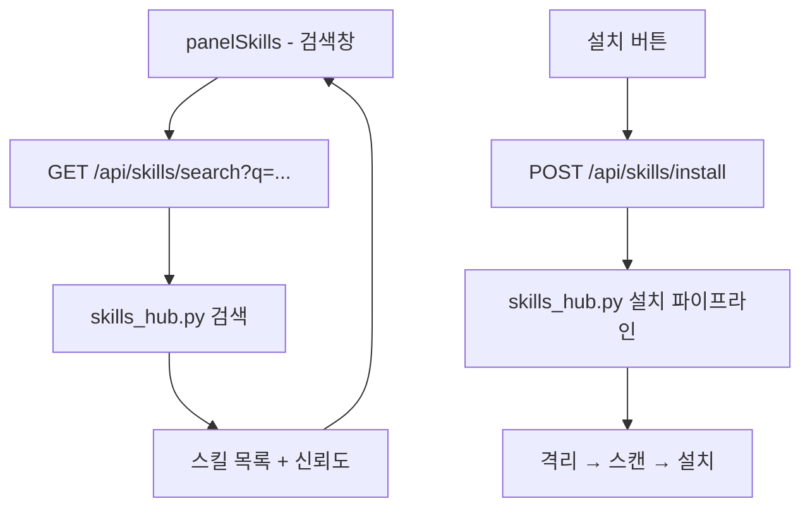

# Daon Agent System — ai-setup 기능 통합 구현 계획

## 시스템 아키텍처 개요



---

## 🥇 Config Score (설정 완성도 100점 평가)

### 목표
현재 Daon + Hermes의 설정 상태를 분석하여 100점 만점으로 점수화하고, 대시보드와 Settings 모달에서 표시.

### 평가 카테고리 (총 100점)

| # | 카테고리 | 배점 | 평가 항목 | 데이터 소스 |
|---|----------|------|-----------|-------------|
| 1 | API 키 | 25점 | 등록된 프로바이더 수, API 키 유효성 | `custom_providers.json` |
| 2 | 모델 설정 | 15점 | 기본 모델 지정 여부, fallback 모델, 모델 다양성 | `settings.json`, `custom_providers.json` |
| 3 | 프로필 | 15점 | 활성 프로필, SOUL/AGENTS.md 존재 여부, 프로필 다양성 | `~/.hermes/profiles/`, `api/profiles.py` |
| 4 | MCP 서버 | 15점 | 등록된 MCP 서버 수, 연결 상태 | `mcp_servers.json` |
| 5 | 워크스페이스 | 10점 | 등록된 워크스페이스 수, 유효 경로 | `workspaces.json` |
| 6 | 통합 | 10점 | Slack/Notion 연동 활성화 여부 | `integration_config.json` |
| 7 | 스킬 | 5점 | 설치된 스킬 수, 커스텀 스킬 유무 | `skills/` 디렉터리 |
| 8 | 보안 | 5점 | 비밀번호 설정, API 키 마스킹 | `settings.json`, 환경변수 |

### 구현 파일

```
신규:
  api/score_engine.py          # 점수 평가 엔진 (순수 함수)
  api/routes/score_routes.py   # GET /api/score/evaluate
  static/modules/score.js      # 프론트엔드 점수 렌더링

수정:
  api/routes/__init__.py       # score_routes import 추가
  server.py                     # GET /api/score 라우트 등록
  index.html                    # scorePanel 또는 settings 내 점수 표시
  static/styles.css             # 점수 카드/게이지 스타일
```

### API 설계

```
GET /api/score/evaluate
→ Response:
{
  "total_score": 65,
  "grade": "B",
  "categories": [
    {"name": "API 키", "score": 20, "max": 25, "status": "good", "detail": "2개 프로바이더 등록됨 (MiniMax, OpenRouter)"},
    {"name": "모델 설정", "score": 10, "max": 15, "status": "warning", "detail": "기본 모델만 설정됨, fallback 미지정"},
    ...
  ],
  "recommendations": [
    "Slack/Notion 연동을 설정하면 알림을 받을 수 있습니다",
    "MCP 서버를 추가하면 도구 확장이 가능합니다"
  ]
}
```

### 등급 체계
| 점수 | 등급 | 이모지 |
|------|------|--------|
| 90-100 | S | ⭐ |
| 75-89 | A | ✅ |
| 60-74 | B | 👍 |
| 40-59 | C | ⚠️ |
| 0-39 | D | 🔴 |

### UI 배치
- **Settings 모달 상단**: 간략 점수 배지 + 등급
- **대시보드 패널 (`panelDashboard`)**: 상세 점수 카드 + 카테고리별 프로그레스 바 + 개선 권장사항
- 앱 시작 시 Settings 자동 오픈과 함께 점수 표시

---

## 🥈 AI 설정 자동 생성 (AGENTS.md, CLAUDE.md, .cursor/rules)

### 목표
워크스페이스의 프로젝트 구조를 분석하여 AI 코딩 도구용 설정 파일을 자동 생성.

### 생성 대상 파일

| 파일 | 대상 도구 | 내용 |
|------|-----------|------|
| `AGENTS.md` | Hermes, Cursor, Copilot | 프로젝트 개요 + 기술 스택 + 코딩 컨벤션 + 에이전트 운영 규칙 |
| `CLAUDE.md` | Claude Code | 위와 동일 + Claude 특화 지침 |
| `.cursor/rules` | Cursor | Cursor 전용 규칙 포맷 (`.cursorrules` 또는 `.cursor/rules/`) |
| `.github/copilot-instructions.md` | GitHub Copilot | Copilot 전용 지침 |

### 생성 로직



- 기존 [`api/routes/docs_routes.py`](api/routes/docs_routes.py:41)의 `_discover_project_structure()` 재사용
- 언어별 코딩 컨벤션 템플릿 (Python, JS/TS, Go, Rust 등)
- `.gitignore` 분석으로 불필요한 컨텍스트 제외
- 기존 `AGENTS.md`가 있으면 업데이트 모드 (병합 또는 덮어쓰기 선택)

### AGENTS.md 템플릿 구조

```markdown
# Project: {name}

## Tech Stack
- Language: {language}
- Framework: {framework}
- Package Manager: {package_manager}

## Project Structure
{tree}

## Coding Conventions
{auto-detected from existing code patterns}

## Agent Operating Rules
1. Always read {config_files} before making changes
2. Run tests with: {test_command}
3. Build command: {build_command}
```

### 구현 파일

```
신규:
  api/setup_generator.py       # 설정 파일 생성 엔진
  api/routes/setup_routes.py   # POST /api/setup/generate, GET /api/setup/preview
  static/modules/setup.js      # 프론트엔드 생성 UI

수정:
  api/routes/__init__.py       # setup_routes import 추가
  server.py                     # 라우트 등록
  index.html                    # panelDocs 또는 panelSetup 연동
  static/styles.css             # 생성 폼 스타일
```

### API 설계

```
POST /api/setup/generate
Body: {
  "workspace": "/path/to/project",
  "file_types": ["agents.md", "claude.md", "cursor_rules", "copilot_instructions"],
  "overwrite": false
}
→ Response: { "generated": ["AGENTS.md", "CLAUDE.md", ".cursor/rules"], "skipped": [] }

GET /api/setup/preview?workspace=...&file_type=agents.md
→ Response: { "content": "...", "will_overwrite": false }
```

---

## 🥉 MCP 자동 추천

### 목표
워크스페이스 내 파일 패턴을 감지하여 필요한 MCP 서버를 자동 추천.

### 감지 규칙

| 감지 패턴 | 추천 MCP 서버 |
|-----------|---------------|
| `*.sqlite3`, `*.db`, `sqlalchemy`, `prisma/` | SQLite MCP |
| `Dockerfile`, `docker-compose.yml` | Docker MCP |
| `package.json` (React/Vue/Next) | Playwright MCP |
| `requirements.txt` (FastAPI), `*.proto` | 다양한 API MCP |
| `.github/workflows/` | GitHub MCP |
| `*.md` 다수 존재 | Filesystem/Memory MCP |
| `docker-compose.yml` + PostgreSQL | PostgreSQL MCP |

### 구현 파일

```
신규:
  api/mcp_recommender.py       # 프로젝트 감지 + 추천 엔진
  api/routes/mcp_routes.py (확장) # GET /api/mcp/recommend?workspace=...
  static/modules/mcp.js (확장)  # 추천 UI

수정:
  api/routes/mcp_routes.py     # handle_get_mcp_recommend 추가
  api/routes/__init__.py       # 필요 시 import 추가
  server.py                     # 라우트 등록
  index.html                    # panelMcp에 추천 섹션 추가
```

### API 설계

```
GET /api/mcp/recommend?workspace=/path/to/project
→ Response:
{
  "recommendations": [
    {
      "mcp_id": "sqlite",
      "label": "SQLite MCP Server",
      "reason": "SQLite 데이터베이스 파일 감지됨 (data/*.json, *.sqlite3)",
      "confidence": "high",
      "preset": { "command": "npx", "args": ["-y", "@anthropic/mcp-server-sqlite", "data/"] }
    }
  ]
}
```

### UI 흐름
1. MCP 패널 상단에 "워크스페이스 분석" 버튼
2. 분석 결과: 추천 MCP 목록 (신뢰도 표시)
3. "설치" 버튼 — 즉시 MCP 서버 등록
4. 이미 설치된 서버는 "✓ 이미 설치됨" 표시

---

## 4. 자동 동기화 (파일 와처 + Git 훅)

### 목표
코드 변경 시 AI 설정 파일(AGENTS.md, CLAUDE.md 등)을 자동으로 갱신.

### 두 가지 구현 방식

#### A. 백그라운드 파일 와처 (watchdog)
- Python `watchdog` 라이브러리로 워크스페이스 감시
- `.py`, `.js`, `.ts`, `.json`, `package.json`, `requirements.txt` 등 변경 감지
- 디바운스 5초 → AGENTS.md/CLAUDE.md 자동 재생성
- Settings에서 켜기/끄기 토글

#### B. Git 훅 (선택 사항)
- `.git/hooks/post-commit` → AGENTS.md 갱신
- `.git/hooks/post-merge` → 브랜치 병합 시 갱신
- `npx daon hook install` CLI 명령어 (또는 UI 버튼)

### 구현 파일

```
신규:
  api/sync_watcher.py          # watchdog 기반 파일 감시 엔진
  api/routes/sync_routes.py    # POST /api/sync/start, POST /api/sync/stop, GET /api/sync/status

수정:
  api/routes/__init__.py       # sync_routes import 추가
  server.py                     # 서버 시작 시 와처 초기화 (선택)
  static/modules/setup.js      # 동기화 토글 UI
  data/settings.json (스키마 확장) # sync_enabled, sync_interval
```

### API 설계

```
POST /api/sync/start
Body: { "workspace": "/path/to/project", "watch_for": ["agents.md", "claude.md"] }
→ Response: { "ok": true, "watcher_id": "abc123" }

POST /api/sync/stop
Body: { "watcher_id": "abc123" }
→ Response: { "ok": true }

GET /api/sync/status?watcher_id=abc123
→ Response: { "running": true, "last_sync": "2026-07-10T16:00:00Z", "files_watched": 45 }
```

---

## 5. 커뮤니티 스킬 검색 및 설치

### 목표
Hermes의 [`skills_hub.py`](hermes-agent/tools/skills_hub.py:1)를 Daon UI에서 활용하여 외부 스킬 검색 및 설치.

### 기존 인프라 활용

[`skills_hub.py`](hermes-agent/tools/skills_hub.py:63)는 이미 다음을 제공:
- `SkillMeta` 데이터 모델
- GitHub Contents API 기반 스킬 검색
- 공식/커뮤니티/trusted 분류
- `_search_score()` 검색 알고리즘 (이름, 설명, 태그 기반 매칭)
- Quarantine + 감사 로그

### UI 연동 설계



### 구현 파일

```
신규:
  api/routes/skills_hub_routes.py  # GET /api/skills/search, POST /api/skills/install
  static/modules/skills_hub.js    # 검색 UI, 결과 렌더링, 설치 진행

수정:
  api/routes/__init__.py          # skills_hub_routes import 추가
  server.py                        # 라우트 등록
  index.html                       # panelSkills에 검색/설치 섹션 추가
  static/styles.css                # 검색 결과 카드 스타일
```

### API 설계

```
GET /api/skills/search?q=pdf&source=github,official&limit=20
→ Response:
{
  "results": [
    {
      "name": "pdf-tools",
      "description": "PDF manipulation toolkit",
      "source": "github",
      "trust_level": "trusted",
      "repo": "anthropics/skills",
      "tags": ["pdf", "document"],
      "score": 95
    }
  ],
  "total": 5
}

POST /api/skills/install
Body: { "identifier": "anthropics/skills/pdf-tools", "source": "github" }
→ Response: { "ok": true, "installed_to": "~/.hermes/skills/pdf-tools" }
```

---

## 구현 순서 (권장)

```
Phase 1: Config Score (🥇)
├── api/score_engine.py           # 순수 점수 계산 함수
├── api/routes/score_routes.py    # API 엔드포인트
├── static/modules/score.js       # UI 렌더링
├── index.html                    # 대시보드 패널 + Settings 배지
└── static/styles.css             # 점수 스타일

Phase 2: AI 설정 자동 생성 (🥈)
├── api/setup_generator.py        # 생성 엔진
├── api/routes/setup_routes.py    # API 엔드포인트
├── static/modules/setup.js       # UI
└── index.html                    # Setup/Docs 패널

Phase 3: MCP 자동 추천 (🥉)
├── api/mcp_recommender.py        # 감지 + 추천 엔진
├── api/routes/mcp_routes.py      # MCP 라우트 확장
├── static/modules/mcp.js         # 추천 UI
└── index.html                    # MCP 패널

Phase 4: 자동 동기화
├── api/sync_watcher.py           # watchdog 감시
├── api/routes/sync_routes.py     # API 엔드포인트
└── static/modules/setup.js       # 토글 UI

Phase 5: 커뮤니티 스킬 검색
├── api/routes/skills_hub_routes.py  # 검색/설치 API
├── static/modules/skills_hub.js    # UI
└── index.html                       # Skills 패널

Phase 6: 통합 빌드 + 백업
├── server.spec 업데이트
├── PyInstaller EXE 빌드
├── Electron NSIS 빌드
└── D:\Daon_Backup 백업
```

---

## 파일 영향도 매트릭스

| 파일 | Phase 1 | Phase 2 | Phase 3 | Phase 4 | Phase 5 | 유형 |
|------|:---:|:---:|:---:|:---:|:---:|------|
| `api/score_engine.py` | 🆕 | | | | | 신규 |
| `api/setup_generator.py` | | 🆕 | | | | 신규 |
| `api/mcp_recommender.py` | | | 🆕 | | | 신규 |
| `api/sync_watcher.py` | | | | 🆕 | | 신규 |
| `api/routes/score_routes.py` | 🆕 | | | | | 신규 |
| `api/routes/setup_routes.py` | | 🆕 | | | | 신규 |
| `api/routes/skills_hub_routes.py` | | | | | 🆕 | 신규 |
| `api/routes/mcp_routes.py` | | | ✏️ | | | 수정 |
| `api/routes/sync_routes.py` | | | | 🆕 | | 신규 |
| `api/routes/__init__.py` | ✏️ | ✏️ | | ✏️ | ✏️ | 수정 |
| `server.py` | ✏️ | ✏️ | ✏️ | ✏️ | ✏️ | 수정 |
| `static/modules/score.js` | 🆕 | | | | | 신규 |
| `static/modules/setup.js` | | 🆕 | | ✏️ | | 신규+수정 |
| `static/modules/mcp.js` | | | ✏️ | | | 수정 |
| `static/modules/skills_hub.js` | | | | | 🆕 | 신규 |
| `index.html` | ✏️ | ✏️ | ✏️ | | ✏️ | 수정 |
| `static/styles.css` | ✏️ | ✏️ | ✏️ | | ✏️ | 수정 |
| `server.spec` | | | | | ✏️ | 수정 |
| `data/settings.json` | | | | ✏️ | | 수정 |

- 🆕 신규 파일: **9개**
- ✏️ 수정 파일: **10개**
- 총 영향 파일: **19개**
